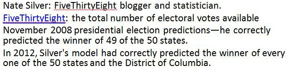
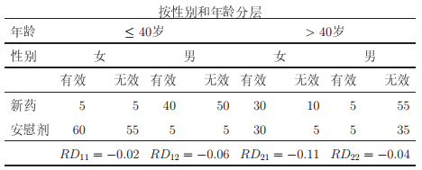
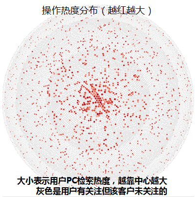
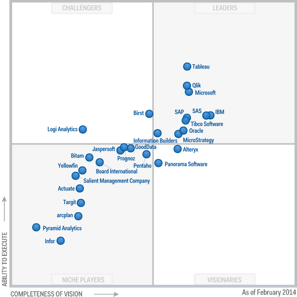

## 大纲
-  **数据**
-  **分析**
-  **方法**  
<br>
  <dfp>
  数据越来越多，信息越来越深。  
  经验pk数据，分析无处不在，合理的值得存在。  
  没有最好的方法，只有最适合的方法。  
  </dfp>
<br>  

***感谢***  
  
<dfp6>
[统计之都](http://cos.name/)  
[Rstudio](http://www.rstudio.com/)  
……
</dfp6>

##  <dfb>数据</dfb>分析方法
- 数据量级
- 抽样分析
- 认识数据

[大数据的九点思考,刘德寰](http://www.emarketing.net.cn/magazine/adetail.jsp?aid=2381) 

##  <dfb>数据</dfb>分析方法
- 数据量级
<dfp6>  
天气、地震、量子物理、基因等，都是大数据；    
任何一个网站的数据都是人们互联网行为数据的很小的一个子集；  
人们面对的是信息过载，有效信息筛选的问题； 
</dfp6>  

  

##  <dfb>数据</dfb>分析方法
- 抽样分析
<dfp6>  
数据量的大幅增加会造成结果的不准确，来源不同的信息混杂会加大数据的混乱程度；    
抽样是简化问题，发现规律的有效方法之一；  
- 美国大选  
永久的课题，始于1936，盖洛普5万随机抽样vs《文学摘要》250万问卷，罗斯福vs蓝顿.(都是样本)  
2012,538模型,Nate Silver.    
</dfp6> 

  
[538美国大选预测模型](http://site.douban.com/146782/widget/notes/15517178/note/321469585/)

##  <dfb>数据</dfb>分析方法
- 认识数据  
  ** 数据是不是客观的  
  ** 规律多样都靠谱么  
  ** 认识是主观的  
  ** 面对数据：从认识自己开始  

##  数据<dfb>分析</dfb>方法
数据只有经过合理的分析，使用合适的方法，才可能得到较为符合实际的结论。  
<dfb>  
   然而，事实是，对于无处不在的数据，只要用上一种方法，就能得到一个结论。  
</dfb>  
下面介绍几个分析角度，描述几个从客观数据到主观推断的风险。  
- 换个视角（圈圈图）  
- 相关性假象  
- 一步到位的分析  
- 辛普森悖论  

##  数据<dfb>分析</dfb>方法
- 噪音大过信息，一团糟的数据中规律在哪儿  
```{r,echo=FALSE,warning=FALSE}
library(MSG)
data(BinormCircle)

```
```{r,echo=TRUE,warning=FALSE,message=FALSE}
par(mfrow = c(1, 2), ann = FALSE)
plot(BinormCircle)
smoothScatter(BinormCircle)

```

##  数据<dfb>分析</dfb>方法
一个简单的方法，改变下观察视角：点的大小+放大
```{r}
par(mfrow = c(1, 1))
plot(BinormCircle,pch=19,cex=0.01)
```

##  数据<dfb>分析</dfb>方法
- 普遍的"相关性"   
```{r,echo=5,warning=FALSE}  
# 小孩的身高体重数据  
fen="../data/babyen.txt";fcn="../data/babycn.txt";
d1=read.table(fen,header=T,sep="\t",encoding="ascii");#head(d1,2)
d2=read.table(fcn,header=T,sep="\t",encoding="ascii");#head(d2,2)
plot(身高~体重,d2)

```

##  数据<dfb>分析</dfb>方法
- 普遍的"相关性"   
```{r,echo=3,warning=FALSE}
# 小孩的身高体重数据
par(new=T)
plot(身高~体重,d2);text(d2[,2],d2[,3],d2[,1]);

```

##  数据<dfb>分析</dfb>方法
- 普遍的"相关性"   
```{r,echo=c(1,4,5),warning=FALSE,message=FALSE}
# 上证综指数
library(quantmod)
options("getSymbols.warning4.0"=FALSE)
getSymbols("^SSEC");SSEC=data.frame(SSEC)
SSEC$t=rownames(SSEC);tail(SSEC)
#plot(filter(SSEC$SSEC.Open/12,rep(1,12)))

```
##  数据<dfb>分析</dfb>方法
- 普遍的"相关性"--身高体重与股价    
```{r,echo=c(2,3,5),warning=FALSE}
library(plotrix)
n=nrow(SSEC);x=1:n;y1=SSEC$SSEC.Volum;y2=SSEC$SSEC.Close;
twoord.plot(x,y1,x,y2,xlim=c(0,n),lylim=c(0,300000),rylim=c(2000,6000), lcol=4,rcol=2,xlab="name",ylab="volume",rylab="close",type=c("bar","b"),xticklab=SSEC$t,halfwidth=0.2)
par(new=T,mar=c(5,8,8,10))
plot(身高~体重,d2,axes=F,col="blue",pch=19,type='b',cex=2,xlab='',ylab='')

```

##  数据<dfb>分析</dfb>方法
- 一步到位的分析（很相关）   
```{r,echo=c(4,5),warning=FALSE}
x = seq(0,4, length = 100)
z = rep(0:4, each   = 20)
y = -x + z + rnorm(100, 0, 0.2)
plot(x, y)
abline(lm(y ~ x), col = "red")

```

##  数据<dfb>分析</dfb>方法
- 一步到位的分析（逆袭--控制变量）   
```{r,warning=FALSE}
plot(x, y, pch = z, col = rainbow(5)[z + 1])
for (i in z) abline(lm(y ~ x, subset = z == i), col = "darkgray")

```

##  数据<dfb>分析</dfb>方法  

+-------+------+------+  
| 统计  |  有效| 无效 |  
+-------+------+------+  
| 新药  | 80   | 120  |  
+-------+------+------+  
| 安慰剂| 100  | 100  |  
+-------+------+------+  
RD = 80/200-100/200= -0.1     

```
| 性别 |   男性  |   女性  |  
| ---- | -- | -- | -- | -- | 
|      |有效|无效|有效|无效|  
| ---- | -- | -- | -- | -- |   
| 新药 | 35 |15  |45  |105 |  RD男 = 35/50-90/150= 0.1  
|安慰剂| 90 |60  |10  |40  |  RD女 = 45/150-10/50= 0.1  
```

- 辛普森悖论  


##  数据<dfb>分析</dfb>方法
- 辛普森悖论2  
 


##  数据分析<dfb>方法</dfb>
1. 分析与观察
2. 统计建模
3. 数据挖掘
4. 分析工具


##  方法--1.分析与观察
最常用的图形  
```{r}
par(mfrow = c(1, 3));
hist(rnorm(100),col='blue');plot(rnorm(20),col='red');
plot(seq(1,10)+runif(10,min=0,max=15),type='b',col='green')

```

##  方法--1.分析与观察
最常用的工具    
[excel图表](http://image.baidu.com/i?tn=baiduimage&ipn=r&ct=201326592&cl=2&lm=-1&st=-1&fm=index&fr=&sf=1&fmq=&pv=&ic=0&nc=1&z=&se=1&showtab=0&fb=0&width=&height=&face=0&istype=2&ie=utf-8&word=excel+%E5%9B%BE%E8%A1%A8&oq=excel+%E5%9B%BE%E8%A1%A8&rsp=-1)  
  
  

##  方法--1.分析与观察
复杂的图形  
 

##  方法--1.分析与观察
复杂的图形-艺术与设计  
 

##  方法--2.统计建模
- 抽样  
- 假设  
- 估计  
- 理论 

##  方法--3.数据挖掘
- 输入  
- 算法  
- 输出  
- 评估  
- 工程  

##  方法--4.分析工具
Magic Quadrant for Business Intelligence and Analytics Platforms. by [gartner](http://www.gartner.com/technology/reprints.do?id=1-1QLGACN&ct=140210&st=sb)  
  
excel,
SPSS,
SAS,
matlab,
R,
weka,
python,
sql,hadoop,storm,spark,
... ...

## 数据>分析>方法--小结

* 兴趣+观察+分析    
* 统计建模  
* 数据挖掘  
* 代码流  
* 工具流  

因地制宜，发挥所长。

## 参考
![1]:谢益辉,2010,"统计图形和模拟视角下的模型理论解析".  
![2]:达莱尔,廖颖林译,2002,《统计陷阱》.  
![3]:耿直,2009,"如何从生命科学研究数据中挖掘因果关系和评价因果作用？"  
![4]:刘德寰,李雪莲,2013,"大数据的风险和现存问题"  

