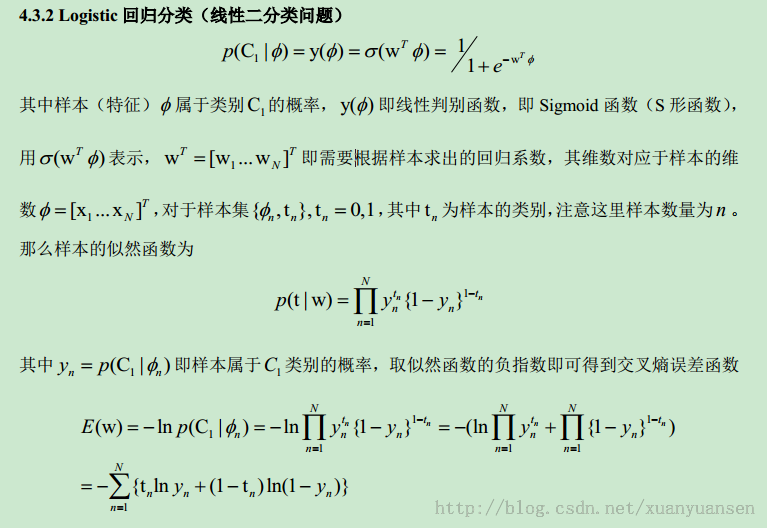
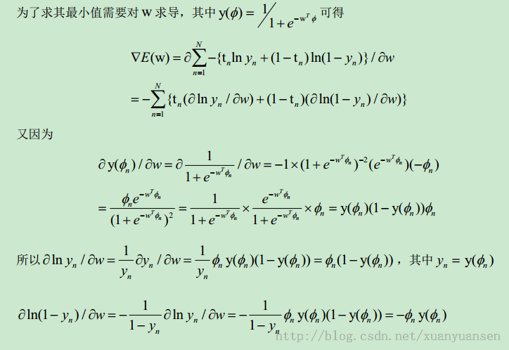

## 大纲
-  **线性回归**  
-  **逻辑回归**    
-  **协同过滤**  


##  线性回归
- 数据描述(pce个人消费支出,psavert个人储蓄率)  
```{r}
data(economics,package="ggplot2"); tail(economics,2)  #help(economics)
x<-economics$psavert
y<-economics$pce
summary(cbind(x,y))
```

##  线性回归
- 负相关  
```{r}
plot(y~x) 
```


##  线性回归
- 参数估计初始化  
```{r}
x <- cbind(1,x)
n <- nrow(x)
#待估参数
aa <- c(0,-10) 
aa2<- c(0,0)
#初始损失函数值
cost <- sum(((x%*%aa)- y)^2)/(2*n)

#学习率
rr <- 0.01
#迭代次数
nt <- 1000

```

##  线性回归
- 参数估计梯度下降  
```{r}
for(i in 1:nt)
{
  aa[1] <- aa[1] - rr * (1/n) * sum(((x%*%aa)- y))
  aa[2] <- aa[2] - rr * (1/n) * sum(((x%*%aa)- y)*x[,2])
}
#估计参数
aa
#预测结果
yp<-x%*%aa
head(cbind(x,y,yp))

```

##  线性回归
- 梯度下降预测结果  
```{r}
x<-x[,2]
plot(y~x) 
lines(yp~x,col='blue')
```

##  线性回归
- lm预测结果  
```{r}
md<-lm(y~x,data=data.frame(cbind(x,y)))
plot(y~x) 
lines(md$fitted.values~x,col='red');lines(yp~x,col='blue')
```

##  线性回归
- 公式推导      
  


##  线性回归
- 公式计算  
```{r}
aa2[2]=(n*sum(x*y)-sum(x)*sum(y))/(n*sum(x^2)-(sum(x))^2)
aa2[1]=mean(y)-aa2[2]*mean(x)
yp2=cbind(1,x)%*%aa2
plot(y~x);lines(md$fitted.values~x,col='red');lines(yp~x,col='blue');lines(yp2~x,col='green')
```

##  线性回归
- 三种方法的估计比较  
```{r}
#梯度下降
aa
#公式
aa2
#lm
md$coefficients
```

##  逻辑回归
- 数据描述  
```{r}
df <- read.csv("../data/admission-data.csv")  
names(df)<-c('s1','s2','label')  
plot(s2~s1,col=as.factor(label),data=df)  
```

##  逻辑回归
- 公式推导      
  

##  逻辑回归
- 公式推导      
  


##  逻辑回归
- 初始化   
```{r}
x <- as.matrix(df[,c(1,2)])  
x <- cbind(1,x)  
y <- as.matrix(df$label)  
  
mysig <- function(z)  
{  
  g <- 1/(1+exp(-z))  
  return(g)  
}  

```

##  逻辑回归
- 损失函数     
```{r}
mycost <- function(aa)  
{  
n <- nrow(x)  
g <- mysig(x%*%aa)  
cost <- (1/n)*sum((-y*log(g)) - ((1-y)*log(1-g)))  
return(cost)  
}  
  
aa <- rep(0,ncol(x))  
mycost(aa)  
```


##  逻辑回归
- 参数估计     
```{r}
aaoptim <- optim(par=aa,fn=mycost)  
aa <- aaoptim$par  ;aa  
yp <- mysig(x%*%aa)  
df$yp=ifelse(yp>=0.5,1,0)  
head(df)  
```

##  逻辑回归
- 预测结果     
```{r}
tb <- with(df, table(label, yp));tb  
prop.table(tb)  

#glm,自行比较

```

##  协同过滤
- 原理示意    
  

##  协同过滤
- 代码示例      
   for(i in 1:nrow(holder))   
   {  
       for(j in 1:ncol(holder))   
       {  
             user <- rownames(holder)[i]  
             product <- colnames(holder)[j]  
             if(as.integer(data.germany[data.germany$user==user,product]) == 1)  
             {   
                 holder[i,j]<-""  
              } else {  
             topN<-((head(n=11,(data.germany.ibs.similarity[order(data.germany.ibs.similarity[,product],decreasing=TRUE),][product]))))  
             topN.names <- as.character(rownames(topN))  
             topN.similarities <- as.numeric(topN[,1])  
             topN.similarities<-topN.similarities[-1]  
             topN.names<-topN.names[-1]  
             topN.purchases<- data.germany[,c("user",topN.names)]  
             topN.userPurchases<-topN.purchases[topN.purchases$user==user,]  
             topN.userPurchases <- as.numeric(topN.userPurchases[!(names(topN.userPurchases) %in% c("user"))])  
             holder[i,j]<-getScore(similarities=topN.similarities,history=topN.userPurchases)  
         } # close else statement  
       } # end product for loop    
   } # end user for loop   


##  参考
![1]: Amar Gondaliya,2013,Linear Regression with R : step by step implementation    
![2]: Amar Gondaliya,2013,Logistic Regression with R: step by step implementation  
![3]: Salem,2014,Collaborative Filtering with R

